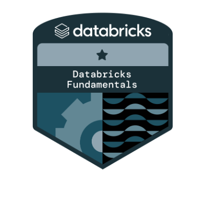

  
## Oii 🙋🏻‍♀️ Sou a Fran!

Trabalho com engenharia de dados, unindo tecnologia e estratégia para construir pipelines eficientes, detectar falhas em fluxos automatizados e garantir que os dados cheguem ao destino do jeito certo.

Tenho experiência com SQL (PrestoSQL 💙), Python, Airflow, Docker/Podman, S3 e arquitetura em camadas (medalhão). Também trago insights valiosos do setor de pagamentos, onde aprendi a importância dos detalhes na reconciliação financeira e na integridade das transações.

Gosto de transformar complexidade em clareza, seja em documentação técnica, modelagem de dados ou no bom e velho Jira para acompanhar os sprints.
Estou sempre buscando melhorar, aprender e entregar com qualidade 🚀

  
### ⚙️ Tecnologias & Ferramentas com as quais trabalho

  
  
  
  
  
  
  
  

### 📜 Certificações

  

### 💬 Vamos nos conectar?

---
<picture>
  <source media="(prefers-color-scheme: dark)" srcset="https://raw.githubusercontent.com/FranMuniz/FranMuniz/output/pacman-contribution-graph-dark.svg">
  <source media="(prefers-color-scheme: light)" srcset="https://raw.githubusercontent.com/FranMuniz/FranMuniz/output/pacman-contribution-graph.svg">
  
</picture>

