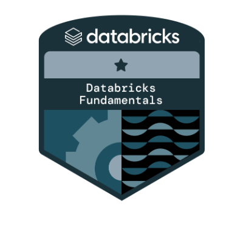
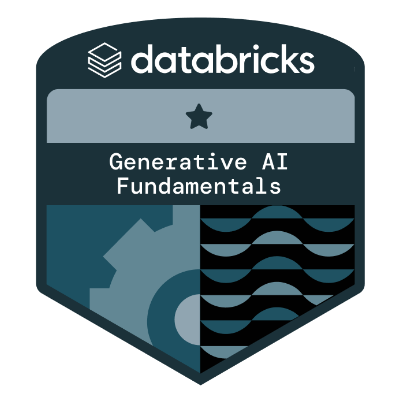

  
## Hi 🙋🏻‍♀️ I'm Fran!

Data engineer focused on building efficient pipelines, detecting failures, and ensuring data integrity. Experienced with PrestoSQL 💙, Python, Airflow, Docker/Podman, S3, and layered architecture.  
Working in the payments sector, specializing in financial reconciliation and transaction integrity. I enjoy turning complexity into clarity — whether in modeling, documentation, or classic Jira sprints. Always striving to improve and deliver quality 🚀

### 🎓 Education

- **Bachelor’s Degree in Computer Science (2021-2024)** 
- **Postgraduate in Data Engineering and Architecture with AI (2025-2026)**
  

### ⚙️ Technologies & Tools I Work With

  
  
  
  
  
  
  
  

### 📜 Certifications

<h2 align="center">📄 Certifications</h2>

<table align="center">
  <tr>
    <td align="center">
      
    </td>
    <td align="center">
      
    </td>
  </tr>
</table>

### 💬 Let's Connect!

---

<picture>
  <source media="(prefers-color-scheme: dark)" srcset="https://raw.githubusercontent.com/FranMuniz/FranMuniz/output/pacman-contribution-graph-dark.svg" />
  <source media="(prefers-color-scheme: light)" srcset="https://raw.githubusercontent.com/FranMuniz/FranMuniz/output/pacman-contribution-graph.svg" />
  
</picture>

